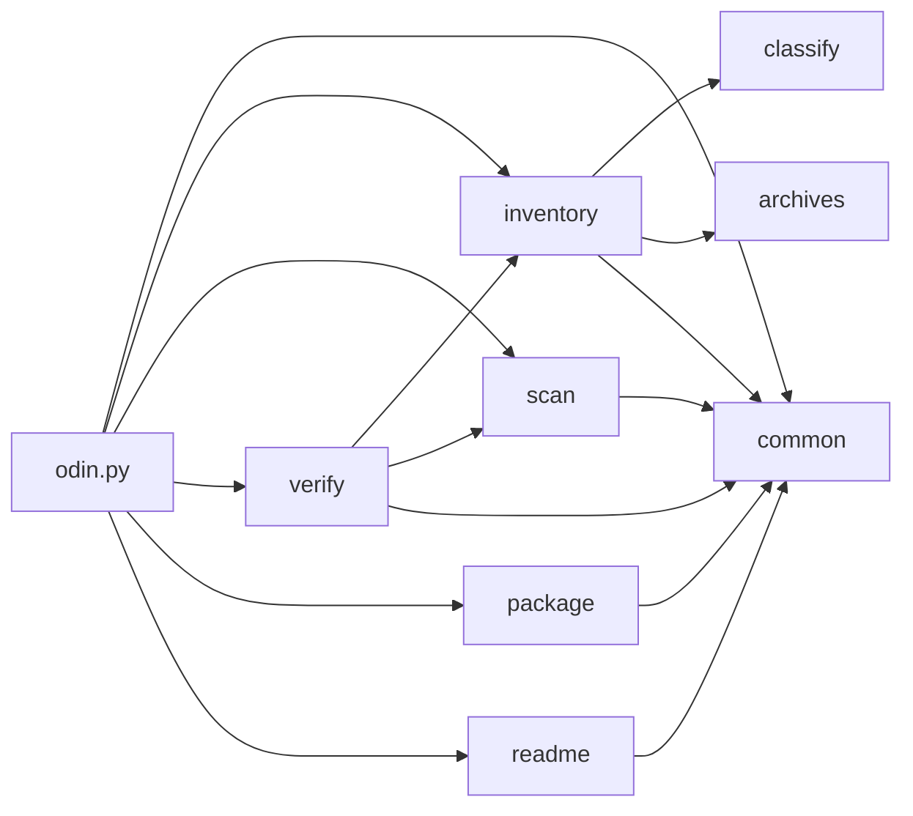

<div align="center">

</div>

## Business Analyst Summary

- **What it does.** ODIN takes one software repository and produces a single, self-contained evidence packet named `findings.zip` that describes the whole thing: what the code is, how it is built and run, what it depends on, what security issues it has, what is tested, and what is unfinished (`SKILL.md`, `PROTOCOL.md`).
- **Who uses it.** Engineers, auditors and reviewers who need a defensible written record of a codebase they did not write. It runs as a skill inside an AI coding assistant (Claude Code or Codex) or as a plain command-line tool (`install/install.ps1`, `install/install.sh`).
- **Key workflow.** Point it at a repository. It inventories every file, analyses the code, documents every file and module, records security and dependency findings, then packages everything with integrity hashes. Twelve ordered phases, from setup to final packaging (`SKILL.md`).
- **Second workflow.** On request it also writes and maintains a repository's own `README.md` as a wiki-style document for business and technical readers (`reference/readme-generation.md`).
- **Key data concepts.** *Evidence packet* (the deliverable), *evidence class* (how strongly each claim is supported), *action manifest* (a log of everything attempted or deliberately skipped), and *inventory* (one record per physical file).
- **Integrations.** None required. It works entirely offline with no accounts, no services and no third-party software (`dependencies/packages.json` in any produced packet). Git and a diagram renderer are used if present and skipped cleanly if not.
- **Operational impact.** The repository being analysed is never modified: a cryptographic baseline is taken before work starts and re-checked afterwards (`scripts/odin_lib/verify.py:90`). Nothing is uploaded anywhere.
- **Key risk control.** Credentials found during analysis are never written into the output and are never tested against any service (`scripts/odin_lib/scan.py:295`). This is enforced by automated tests, not just policy.
- **Assurance.** ODIN has been run against itself. The resulting packet is the evidence base for this README, and it reports ODIN's own remaining shortcomings alongside its strengths.
- **Maturity.** Working and tested (69 automated tests, all passing), running automatically on every change through continuous integration (`.github/workflows/tests.yml`).

## Technical Summary

- **Shape.** A portable agent-skill directory: protocol documents plus a standard-library Python toolkit. Not an application, library or service. 35 project files across 9 modules (`inventory/modules.json` in the produced packet).
- **Runtimes.** Python 3.8 or newer, standard library only. Verified, not merely claimed: all 115 import statements resolve against `sys.stdlib_module_names` (`scripts/odin_lib/`, 11 Python files).
- **No build system.** No compilation, no package manifest, no lockfile. Installation is a directory copy (`install/install.ps1`, `install/install.sh`).
- **Two layers.** Prose defines the protocol (`PROTOCOL.md` is normative and binding; `SKILL.md` is the operating procedure; `reference/` holds nine documents loaded on demand). Code implements only the mechanical parts (`scripts/odin.py`, 16 subcommands over 8 library modules).
- **Hosting model.** None. Single-threaded, sequential, no network code path anywhere, no ports, no listeners, no datastores.
- **Data layer.** None. State is one JSON run-state file plus a generated packet tree, both outside the analysed repository.
- **Security model.** Three controls are enforced in code rather than documentation: an artifact root inside the repository is refused (`scripts/odin.py:65`); secret values are replaced by irreversible fingerprints (`scripts/odin_lib/scan.py:295`); operator-identifying environment values are withheld by class (`scripts/odin.py:260`).
- **Archive safety.** Archive member tables are read from metadata and never extracted, with detection for path traversal, symlink escape, decompression-bomb ratios and nested archives (`scripts/odin_lib/archives.py:167`).
- **Determinism.** Bytewise path ordering, sorted-key JSON, LF endings, no wall-clock time in packet content, and fixed-timestamp archive members. Repackaging identical content is byte-identical (`scripts/odin_lib/package.py:86`).
- **Testing.** 69 tests in 14 classes, standard-library `unittest`, driving the real CLI against throwaway fixture repositories (`tests/test_odin.py`).
- **CI/CD.** GitHub Actions (`.github/workflows/tests.yml`): the suite across three operating systems and Python 3.8 through 3.13, plus a job that runs ODIN against this repository and asserts the guarantees end to end.
- **Observability.** Every subcommand prints a JSON summary to stdout; every material action is appended to `ACTION_MANIFEST.json` with a monotonic sequence number. There is no logging framework, no metrics and no tracing.
- **Where to start.** Read `SKILL.md` for the phase plan, then `scripts/odin.py` for the CLI surface, then `scripts/odin_lib/inventory.py:338` for the traversal that everything else builds on.
- **Where to start (contributors).** `AGENTS.md` states the invariants; run `python -m unittest discover -s tests` before committing.

# ODIN

Deterministic repository forensics. Analyse one repository read-only, produce a reproducible evidence packet named exactly `findings.zip`.

## Last Updated

- **Last Updated:** 2026-09-13
- **Last Commit Date:** 2026-09-13T21:35:47-04:00, commit `336fd1a` on `main` (`inventory/vcs-state.json`, from a read-only `git log`)

## Table of Contents

- [Business Analyst Summary](#business-analyst-summary)
- [Technical Summary](#technical-summary)
- [Last Updated](#last-updated)
- [Repository Overview](#repository-overview)
- [Components](#components)
- [Architecture Overview](#architecture-overview)
- [Tech Stack and Dependencies](#tech-stack-and-dependencies)
- [Project Layout](#project-layout)
- [Getting Started (Local Development)](#getting-started-local-development)
- [Configuration](#configuration)
- [Running the System](#running-the-system)
- [Deployment and CI/CD](#deployment-and-cicd)
- [Deep Code Reference](#deep-code-reference)
- [Data and Integrations](#data-and-integrations)
- [Security Notes](#security-notes)
- [Observability and Monitoring](#observability-and-monitoring)
- [Common Tasks and Troubleshooting](#common-tasks-and-troubleshooting)
- [Contributing](#contributing)
- [License](#license)

## Repository Overview

ODIN is an agent skill: one directory consumed by Claude Code (as a skill with YAML frontmatter in `SKILL.md`), by Codex (via `AGENTS.md` and a `/odin` slash prompt in `prompts/odin.md`), and by any other agent that can read Markdown and run Python.

Given a repository, it produces an evidence packet containing:

- Executive summary, repository overview and architecture synthesis
- One documentation record per physical file, including binaries, generated code, vendored trees and `.git` internals
- One record per module, with a stable module identifier
- Exhaustive file inventory with SHA-256 for every file, and classification keyed to explicit evidence rules
- Symbols, types, imports and relationship graphs, recording which parser produced them
- Dependency graph, CycloneDX and SPDX SBOMs, licences and advisories
- Security findings in SARIF, plus redacted secret candidates
- Test inventory, results and measured coverage, or an explicit statement that none was measured
- Mermaid diagrams for architecture, modules, runtime, data flow, build and test, dependencies and sequences
- Reproducibility instructions, an action manifest of everything attempted and skipped, tool versions, and integrity hashes

The guarantees, and how each is enforced:

| Guarantee | Enforcement |
| --- | --- |
| The repository is never modified | SHA-256 baseline before analysis, full re-verification after; an artifact root inside the repository is refused |
| Nothing is invented | every conclusion carries an evidence label: OBSERVED, DECLARED, DERIVED, DOCUMENTED, INFERRED |
| No secret is exposed | category, location, redaction and an irreversible fingerprint, never the value, never a validation attempt |
| No untrusted code runs unsandboxed | dynamic analysis is gated on real isolation; without it, static analysis only, documented as skipped |
| The run is reproducible | fixed environment, bytewise ordering, no wall-clock time in packet content, byte-identical packaging |
| Failures do not abort the run | fail-soft with documented fallbacks; a partial packet beats no packet |

### Self-analysis results

ODIN has been run against its own source. Every figure below comes from that packet, not from estimation.

| Measure | Result |
| --- | --- |
| Files inventoried | 136 regular files (35 project files, 101 Git internals) across 93 directories |
| Modules documented | 9 |
| Symbols indexed | 295, via the native CPython `ast`, 0 parse errors |
| Third-party dependencies | 0, verified against `sys.stdlib_module_names` |
| Tests | 69 discovered, 69 passed, 0 failed, 0 skipped, green on all 8 CI legs |
| Coverage | not measured, which is not zero percent |
| Security findings | 2 Low, 1 Informational, 1 Low disclosure; 2 previously-reported Medium findings resolved |
| Repository integrity after the run | PASS, all 136 files re-hashed identically |
| Packaging | byte-identical across consecutive runs, demonstrated and regression-tested |

## Components

| Component | Type | Language/Framework | Runtime/Target | Path | Purpose |
| --- | --- | --- | --- | --- | --- |
| skill-entrypoints | Documentation | Markdown | read by agents and humans | `.` | `SKILL.md`, `PROTOCOL.md`, `AGENTS.md`, `README.md`, `LICENSE` and repository metadata |
| reference | Documentation | Markdown | loaded on demand per phase | `reference/` | Nine operational documents plus the project image |
| templates | Documentation | Markdown | copied when writing packet records | `templates/` | Skeletons for per-file, per-module and top-level documents |
| scripts-cli | CLI tool | Python (argparse) | CPython 3.8+ | `scripts/odin.py` | Sixteen subcommands; run-state lifecycle, environment policy, rendering, doc stubs, action log |
| scripts-lib | Library | Python | CPython 3.8+ | `scripts/odin_lib/` | Eight standard-library modules implementing the mechanical protocol requirements |
| tests | Test suite | Python `unittest` | CPython 3.8+ | `tests/` | 69 regression tests protecting the guarantees |
| ci | CI/CD | GitHub Actions YAML | GitHub-hosted runners | `.github/` | Runs the suite on every change and asserts the guarantees end to end |
| prompts | Configuration | Markdown with frontmatter | Codex slash prompt | `prompts/` | `/odin` prompt shim with an installer-substituted path |
| install | Build/tooling | PowerShell, POSIX shell | Windows, macOS, Linux | `install/` | Copy the skill into the Claude Code and Codex skill directories |

Module boundaries are INFERRED at priority 5 (coherent directory), because the repository declares no workspace, manifest or build system (`inventory/modules.json`).

## Architecture Overview


Internal dependency structure, with no cycles (DERIVED from import analysis):



`classify`, `archives` and `common` are leaf modules. `verify` depends on three others, matching its role as the phase that cross-checks everyone else's output.

## Tech Stack and Dependencies

| Layer | Technology | Evidence |
| --- | --- | --- |
| Language | Python 3.8+, standard library only | `scripts/odin_lib/`, 11 Python files |
| CLI framework | `argparse` | `scripts/odin.py` |
| Hashing and integrity | `hashlib`, SHA-256 throughout | `scripts/odin_lib/common.py` |
| Archive handling | `zipfile`, `tarfile`, metadata only | `scripts/odin_lib/archives.py:167` |
| Packaging | `zipfile` with fixed timestamps and sorted members | `scripts/odin_lib/package.py:86` |
| Parsing | native CPython `ast` for Python sources | `static-analysis/symbols.jsonl` in a produced packet |
| Testing | `unittest` | `tests/test_odin.py` |
| Documentation | Markdown, Mermaid diagram sources | `reference/`, `graphs/*.mmd` in a produced packet |

**Third-party dependencies: none.** All 115 import statements resolve to the standard library: `__future__`, `argparse`, `fnmatch`, `hashlib`, `io`, `json`, `math`, `os`, `pathlib`, `platform`, `posixpath`, `re`, `shutil`, `stat`, `subprocess`, `sys`, `tarfile`, `tempfile`, `unicodedata`, `unittest`, `zipfile`.

Optional external tools, each degrading cleanly when absent:

| Tool | Use | If absent |
| --- | --- | --- |
| `git` | read-only repository metadata | recorded as unavailable; inventory unaffected |
| `mmdc` | local Mermaid rendering | `RENDER_STATUS.json` records unavailable; `.mmd` sources retained |

## Project Layout

```
  - SKILL.md                  entry point: five hard rules, inputs, phases 0-12, reference map
  - PROTOCOL.md               the normative protocol; binding, wins over everything else
  - AGENTS.md                 entry point for agents working in or on this directory
  - README.md                 this document
  - LICENSE                   MIT
  - reference/
    - phases.md               per-phase entry and exit criteria
    - toolkit.md              full CLI reference
    - evidence.md             evidence classes, confidence, fallback ladders
    - sandbox.md              the dynamic-execution boundary and per-ecosystem playbooks
    - dependencies-and-sbom.md
    - security.md             finding records, secrets contract
    - architecture.md         module identity and diagram conventions
    - packet.md               the output packet contract
    - readme-generation.md    repository README specification
    - odin.png                project image
  - templates/
    - file-record.md
    - module-record.md
    - top-level-documents.md
  - scripts/
    - odin.py                 CLI dispatcher, 16 subcommands
    - odin_lib/
      - common.py             state, deterministic IO, hashing, paths
      - classify.py           format, language and role classification
      - inventory.py          the exhaustive filesystem traversal
      - archives.py           archive member tables, never extracted
      - scan.py               unfinished-work and secret scanners
      - readme.py             README discovery and formatting enforcement
      - verify.py             integrity verification and packet validation
      - package.py            manifest and deterministic packaging
  - tests/
    - test_odin.py            69 tests across 14 classes
  - .github/
    - workflows/
      - tests.yml           CI: the suite plus end-to-end guarantee assertions
  - prompts/
    - odin.md                 Codex slash-prompt shim
  - install/
    - install.ps1             PowerShell installer
    - install.sh              POSIX installer
```

## Getting Started (Local Development)

**Requirements:** Python 3.8 or newer. Nothing else. No `pip install` step exists because there is nothing to install.

Clone, then verify the toolkit works:

```
python scripts/odin.py --help
python -m unittest discover -s tests
```

The test suite takes roughly 20 seconds and requires no network, no fixtures on disk and no configuration.

Install as a skill for your CLI:

```
# Windows
.\install\install.ps1                  # every CLI detected
.\install\install.ps1 -Target claude   # Claude Code only

# macOS / Linux
./install/install.sh                   # every CLI detected
./install/install.sh --target codex    # Codex only
```

This copies the skill to `~/.claude/skills/odin` and `~/.codex/skills/odin`, and writes `~/.codex/prompts/odin.md` with the resolved skill path substituted in. Use `--scope project` to install into `<project>/.claude/skills` instead. Nothing is overwritten without `--force` or `-Force`.

## Configuration

ODIN reads three environment variables. It has no configuration file.

| Variable | Read by | Effect |
| --- | --- | --- |
| `ODIN_ARTIFACT_ROOT` | `scripts/odin.py` | Locates the run state when `--artifacts` is not passed |
| `ODIN_HOME` | `install/install.ps1` | Overrides home-directory resolution during install |
| `CODEX_HOME` | both installers | Overrides the Codex directory |

It also *sets* a fixed environment for every child process, to keep runs reproducible: `TZ=UTC`, `LC_ALL=C.UTF-8`, `LANG=C.UTF-8`, `PYTHONHASHSEED=0`, `PYTHONIOENCODING=utf-8`, `SOURCE_DATE_EPOCH=315532800`, `umask=022` (`scripts/odin_lib/common.py`). Anything that cannot be applied is recorded rather than ignored.

**Environment disclosure policy.** When recording the analysis environment, values appear only for variables that describe build posture and identify nobody. Credential-shaped names, path lists and operator-identifying locations are withheld by class (`scripts/odin.py:260`), so a produced packet is shareable.

## Running the System

Through an agent:

- **Claude Code:** `/odin`, or ask directly, for example "audit this repository with ODIN"
- **Codex:** `/odin [REPO_ROOT] [--artifacts DIR] [--network denied] [--sandbox none]`
- **Any other agent:** point it at this directory and tell it to read `SKILL.md`

Directly, as a toolkit:

```
export ODIN_ARTIFACT_ROOT=/tmp/odin-run
python scripts/odin.py init --repo /path/to/repo --artifacts "$ODIN_ARTIFACT_ROOT"
python scripts/odin.py env
python scripts/odin.py inventory
python scripts/odin.py todos
python scripts/odin.py secrets
python scripts/odin.py readme-scan
python scripts/odin.py render
python scripts/odin.py docstub
#   the agent writes the analysis and completes every record
python scripts/odin.py verify
python scripts/odin.py validate
python scripts/odin.py manifest
python scripts/odin.py package
```

Every subcommand prints a JSON summary to stdout and exits non-zero when its own status is FAIL.

## Deployment and CI/CD

**CI:** GitHub Actions, defined in `.github/workflows/tests.yml`, triggered on push to `main`, on pull request, and manually. It runs with read-only permissions and uses no secrets.

| Job | What it does |
| --- | --- |
| `tests` | The suite across ubuntu, windows and macos, on Python 3.8, 3.9, 3.10, 3.12 and 3.13. The 3.8 leg is pinned to ubuntu-22.04 because ubuntu-24.04 no longer provides it, and exists specifically to keep the "Python 3.8+" claim honest. Also fails if a dependency manifest ever appears, which would break the standard-library-only invariant |
| `guarantees` | Runs ODIN against this repository and asserts the promises directly: the repository is unchanged afterwards, no bytecode cache is written into it, packaging is byte-identical across two runs, no operator value reaches the packet, and the README satisfies its formatting contract |

The second job matters more than it looks. These guarantees fail *silently* when they regress: nothing errors, output just quietly stops being deterministic or stops being redacted. Asserting them on every change is the only way to notice.

**Deployment** is a directory copy performed by `install/install.ps1` or `install/install.sh`. There are no containers, no infrastructure-as-code artifacts and no release pipeline (OBSERVED absence).

## Deep Code Reference

### Cross-Reference Index

| Module | File Path | Key Methods | Notes |
| --- | --- | --- | --- |
| CLI dispatcher | `scripts/odin.py` | `cmd_init:65`, `cmd_env:260`, `cmd_inventory:328`, `cmd_docstub:430`, `cmd_readme_scan:486`, `cmd_readme_lint:505` | Sixteen subcommands; `main()` dispatches through `args.func` |
| Shared foundation | `scripts/odin_lib/common.py` | `norm_rel:75`, `safe_doc_path:93`, `sort_key:132`, `find_state:153`, `State:178` | Every determinism guarantee traces back here |
| Classification | `scripts/odin_lib/classify.py` | `detect_magic:510`, `detect_shebang:522`, `detect_modeline:541`, `classify_extension:576`, `role_hints:594`, `origin_hints:680` | Evidence rules E1 to E7 and E10; preserves conflicting signals |
| Inventory | `scripts/odin_lib/inventory.py` | `walk:338`, `collect_git_state:179`, `sniff_text:49`, `load_gitattributes:129` | Filesystem traversal, not gitignore, defines the inventory |
| Archives | `scripts/odin_lib/archives.py` | `archive_kind:46`, `inspect:167` | Member tables only; nothing is ever extracted |
| Scanners | `scripts/odin_lib/scan.py` | `scan_todos:96`, `scan_secrets:295`, `audit_packet_for_leaks:442`, `shannon_entropy:257` | The redaction contract lives here |
| README support | `scripts/odin_lib/readme.py` | `scan:142`, `lint:340`, `slugify:331` | Technology discovery and formatting enforcement |
| Verification | `scripts/odin_lib/verify.py` | `verify_integrity:90`, `validate:427` | Integrity baseline comparison and the pre-packaging gate |
| Packaging | `scripts/odin_lib/package.py` | `build_manifest:36`, `verify_manifest:57`, `build_zip:86` | Sorted, fixed-timestamp, byte-reproducible |

### Command Surface

There is no HTTP or RPC surface. The public interface is the CLI.

| Command | Purpose | Writes |
| --- | --- | --- |
| `init` | Resolve roots, create the packet skeleton, apply the determinism environment | `.odin-state.json`, `ACTION_MANIFEST.json` |
| `env` | Probe tool versions, record a sanitized environment | `inventory/environment.json` |
| `inventory` | Exhaustive traversal, hashing, classification, archive member tables | `inventory/*` |
| `todos` | Unfinished-work scan with fixture and vendor separation | `static-analysis/unfinished-work.json` |
| `secrets` | Redacted secret-candidate scan | `security/secrets-redacted.json` |
| `docstub` | Seed one document per physical regular file | `files/**` |
| `readme-scan` | Technology discovery and component map | `readme/component-map.json` |
| `readme-lint` | Enforce README formatting constraints | `readme/lint-report.json` |
| `render` | Render Mermaid diagrams if a local renderer exists | `graphs/rendered/` |
| `log` | Append a sequence-numbered action record | `ACTION_MANIFEST.json` |
| `verify` | Recompute repository hashes against the baseline | `inventory/integrity-verification.json` |
| `validate` | Completeness, structure, privacy and honesty checks | `VALIDATION.json` |
| `manifest` | Generate and verify `MANIFEST.sha256` | `MANIFEST.sha256` |
| `package` | Build and verify `findings.zip` deterministically | `findings.zip` |
| `status` | Report run progress | nothing |

## Data and Integrations

**Data stores: none.** No database, cache, object store, queue or message broker is used anywhere (DERIVED: no such client library is imported).

**External services: none.** There is no network code path in the toolkit. Network access is denied by default and, when a caller explicitly authorises it, is limited to package identifiers and advisory lookups, never repository source.

**Persistent state** is two things, both outside the analysed repository:

| State | Location | Purpose |
| --- | --- | --- |
| Run state | `ARTIFACT_ROOT/.odin-state.json` | Roots, policies, sequence counter, platform facts |
| Packet tree | `ARTIFACT_ROOT/findings/` | All generated evidence |

**File formats produced:** JSON and JSONL (sorted keys, LF), Markdown, Mermaid `.mmd`, SARIF 2.1.0, CycloneDX 1.5, SPDX 2.3, SHA-256 manifests, and a deflate ZIP archive.

## Security Notes

**Controls enforced in code, not documentation:**

| Control | Implementation | Regression test |
| --- | --- | --- |
| Generated output cannot land in the evidence tree | `scripts/odin.py:65` refuses an artifact root inside the repository | `TestNonModification` |
| The repository is never modified | SHA-256 baseline and re-verification, `scripts/odin_lib/verify.py:90` | `TestNonModification` |
| Secret values never reach the packet | replaced by a salted, truncated SHA-256, `scripts/odin_lib/scan.py:295` | `TestRedaction` |
| Operator identity never reaches the packet | four-class environment policy, `scripts/odin.py:260` | `TestOperatorPrivacy` |
| Archives are never extracted | metadata-only member tables, `scripts/odin_lib/archives.py:167` | `TestArchiveInspection` |
| Unmeasured coverage cannot carry a number | `scripts/odin_lib/verify.py:427` | `TestValidation` |
| No bytecode cache is written into the repository | `sys.dont_write_bytecode` set before the library imports, `scripts/odin.py` | `TestNonModification` |

**Known findings from self-analysis:**

| ID | Severity | Title |
| --- | --- | --- |
| ODIN-SEC-0001 | Low | External process execution uses list-form `subprocess` with `shell=False`; no injection path identified |
| ODIN-SEC-0003 | Informational | Archive member tables are read without extraction |
| ODIN-SEC-0004 | Low | Scanner regexes run against untrusted text, bounded by size, line and match caps |
| ODIN-SEC-0006 | Low | `ACTION_MANIFEST.json` records absolute repository paths, which is protocol-sanctioned. Review before sharing a packet externally |

**Resolved since the previous self-analysis:** ODIN-SEC-0002 (Medium, packets recorded the operator's `PATH` and `HOME`) and ODIN-SEC-0005 (Medium, no licence).

**What this does not establish.** No SAST tool was available during self-analysis, so whole classes of defect were never looked for. Nothing ran under sandbox isolation. The repository is not "secure" because review found little; it is small, dependency-free and network-free, which is an argument about attack surface, not a clean bill of health.

**Authentication and authorisation:** not applicable. There are no users, sessions, cookies, tokens or access controls.

## Observability and Monitoring

There is no logging framework, no metrics and no tracing. Observability comes from three deliberate mechanisms:

| Mechanism | What it gives you |
| --- | --- |
| JSON on stdout | Every subcommand prints a structured summary; non-zero exit on its own FAIL status |
| `ACTION_MANIFEST.json` | Every material action attempted or skipped, with a monotonic sequence number, tool version, exact sanitized command, exit code and reason. Actions that failed, timed out, were unavailable or were blocked by policy are recorded alongside successes |
| `VALIDATION.json` | The pre-packaging report: completeness, structure, privacy, coverage honesty and manifest integrity |

Sequence numbers are used instead of timestamps so that packet content stays reproducible.

## Common Tasks and Troubleshooting

| Task | Command |
| --- | --- |
| Run the tests | `python -m unittest discover -s tests` (CI runs the same command) |
| Check run progress | `python scripts/odin.py status` |
| See why validation failed | `python scripts/odin.py validate`, then read `VALIDATION.json` |
| Confirm the repository was untouched | `python scripts/odin.py verify` |
| Check a README against the formatting rules | `python scripts/odin.py readme-lint --path README.md` |

| Symptom | Cause and fix |
| --- | --- |
| `no ODIN state file found` | `init` has not run, or `ODIN_ARTIFACT_ROOT` is unset. Pass `--artifacts` explicitly |
| `ARTIFACT_ROOT must be physically outside REPO_ROOT` | Working by design. Choose an output directory outside the repository |
| Validation reports documents "still stubbed" | `docstub` seeds records; every `PENDING` must be completed before packaging |
| Validation reports a coverage contradiction | `coverage-summary.json` says `measured: false` but contains a percentage. Not measured is not zero percent |
| `render` reports `unavailable` | No local Mermaid renderer. Not an error; the `.mmd` sources are canonical |
| Inventory count looks too small | Traversal was blocked. Check `inventory/traversal-errors.json` before trusting the packet |

## Contributing

Read `AGENTS.md` first; it states the invariants.

**Toolkit constraints, which are not negotiable:**

- Python 3.8+, **standard library only**. No third-party package, ever
- No network access
- Never write into `REPO_ROOT`
- Never execute repository-controlled code
- Deterministic output: sorted keys, bytewise path ordering, LF endings, no wall-clock time in packet content

**Before committing:** run `python -m unittest discover -s tests`. The suite covers the promises that are easy to break silently. CI runs the same suite on every push and pull request, plus end-to-end guarantee assertions.

**If you change what the packet must contain,** update all four of: the contract section of `PROTOCOL.md`, `reference/packet.md`, `REQUIRED_PACKET_ARTIFACTS` in `scripts/odin_lib/verify.py`, and the templates.

**Do not reword requirements in `PROTOCOL.md`.** It is reproduced content-faithfully from the source specification. Operational guidance belongs in `reference/`.

**Documentation style:** headings are plain ASCII with no emoji and no ampersands. Box-drawing, arrow, geometric-shape and miscellaneous-technical Unicode ranges are forbidden everywhere, because GitHub renders them as question marks. `python scripts/odin.py readme-lint` enforces this.

## License

MIT. See `LICENSE`.

Copyright (c) 2026 nullcromancer.
