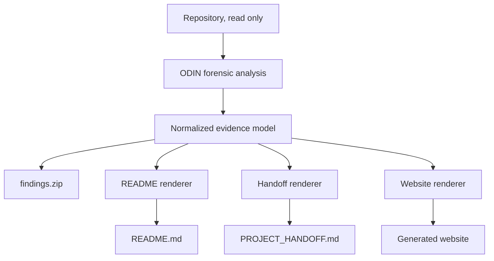
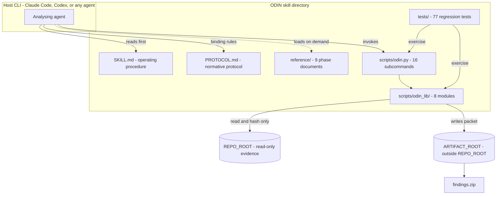
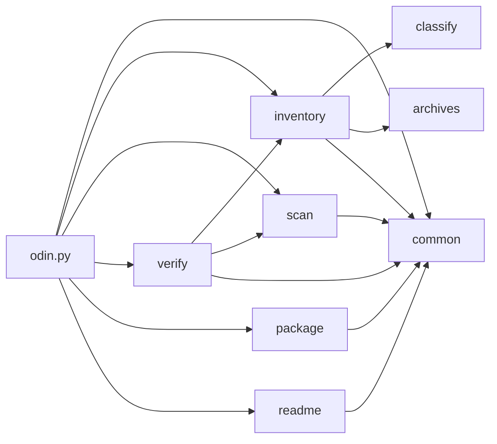

<div align="center">


# ODIN

**Repo forensics for people who would rather know than guess.**

`read everything` · `show your receipts` · `touch nothing` · `package the evidence`
</div>

> **Heads up:** ODIN can produce the forensic packet, a GitHub README, an interactive documentation site, a developer handoff, or the whole pile. The evidence stays the same. Only the presentation changes.

## The Rundown

ODIN reads a repository like somebody just handed it the keys, a flashlight, and a deeply suspicious attitude.

It walks the whole thing, figures out what is actually there, separates facts from educated guesses, and builds a packet another developer can use without spending three days saying, "Okay, but what does this folder do?"

- **The main job:** point ODIN at one repository and it produces `findings.zip`, a self-contained evidence packet covering the code, build and run paths, dependencies, security findings, tests, architecture, unfinished work, and enough context to make the next person dangerous in a productive way (`SKILL.md`, `PROTOCOL.md`).
- **Who it is for:** developers, reviewers, auditors, maintainers, and coding CLIs that need to understand a codebase they did not write.
- **How it works:** phases 0 through 12, in order. Inventory first, analysis second, documentation after that, validation before packaging. No interpretive dance.
- **Other outputs:** the same evidence can feed three human-facing outputs: a serious GitHub README, an interactive documentation site, and a developer handoff. One scan, several useful ways to read it.
- **Evidence matters:** ODIN tracks how every claim was learned. Observed code is not the same thing as a comment claiming something exists, and neither is the same thing as an inference.
- **No service dependency:** it works offline. No accounts. No API keys. No mystery SaaS goblin quietly invoicing you later.
- **The repo stays clean:** ODIN refuses to put its artifact root inside the repository, hashes the repo before analysis, and checks it again afterward (`scripts/odin_lib/verify.py:90`).
- **Secrets stay secret:** possible credentials are recorded as redacted findings with fingerprints. Their values are not copied into the packet and ODIN does not try them against anything (`scripts/odin_lib/scan.py:295`).
- **It eats its own cooking:** ODIN has been run against ODIN. The numbers and limitations in this README come from that packet.
- **Current test state:** 77 automated tests.

Under the hood, ODIN is deliberately boring in several very useful ways:

- Python 3.8 or newer.
- Standard library only.
- No build system.
- No database.
- No listener.
- No network code path.
- No hidden worker farm.
- No "works on my laptop" dependency pile.
- Deterministic output, including byte-identical packaging when the input has not changed.

If you are contributing, start with `SKILL.md`, then `scripts/odin.py`, then `scripts/odin_lib/inventory.py:338`. If you are just trying to understand the project, keep scrolling. That is what this README is for.

## Last Updated

- **Last Updated:** 2026-09-15
- **Last Commit Date:** 2026-09-15T00:18:36-04:00, commit `cd968c9` on `main` (from a read-only `git log`)

## Table of Contents

- [Last Updated](#last-updated)
- [The Rundown](#the-rundown)
- [Why ODIN Exists](#why-odin-exists)
- [Output Profiles](#output-profiles)
- [Presentation Output Architecture](#presentation-output-architecture)
- [Repository Overview](#repository-overview)
- [Components](#components)
- [Architecture Overview](#architecture-overview)
- [Tech Stack and Dependencies](#tech-stack-and-dependencies)
- [Project Layout](#project-layout)
- [Getting Started (Local Development)](#getting-started-local-development)
- [Configuration](#configuration)
- [Running the System](#running-the-system)
- [Deployment and CI/CD](#deployment-and-cicd)
- [Deep Code Reference](#deep-code-reference)
- [Data and Integrations](#data-and-integrations)
- [Security Notes](#security-notes)
- [Observability and Monitoring](#observability-and-monitoring)
- [Common Tasks and Troubleshooting](#common-tasks-and-troubleshooting)
- [Change Log](#change-log)
- [Contributing](#contributing)
- [License](#license)

## Why ODIN Exists

Most project docs are written once, admired briefly, then left in a ditch while the code keeps moving.

ODIN takes the opposite approach. The repository is the evidence. The docs are a view of that evidence. If ODIN cannot prove something, it should say that instead of dressing up a guess in a tie.

The goal is simple: hand a project to someone new and let them answer the questions that normally burn half a week.

- What is this thing actually for?
- What works right now?
- Where does execution start?
- Which parts matter, and which parts are archaeological sediment?
- What does it depend on?
- How do I build it, test it, run it, configure it, and deploy it?
- What talks to what?
- What is unfinished?
- Where are the sharp edges?
- If I have to change something tomorrow morning, where should I start?

The forensic scan and the pretty output are separate on purpose. ODIN learns the project once, keeps the receipts, then formats that knowledge for whoever is reading it.

### The rules ODIN lives by

| Rule | What that means in normal human language |
| --- | --- |
| Evidence first | If ODIN says something is true, it should be able to point at why |
| Analyse once | README, website, handoff, and packet all come from the same evidence model |
| Keep your hands off the repo | Analysis is read-only unless the user explicitly asks for a repository-facing artifact |
| Same facts, different audience | A manager and a maintainer may get different explanations, but not different realities |
| "I don't know" is allowed | `Insufficient Evidence` beats confident nonsense every single time |
| Docs should help somebody do work | Folder-name karaoke is not documentation |

## Output Profiles

ODIN has four output profiles. The evidence packet is the source material. Everything else is a different way of serving it without changing the facts.

| Profile | Main artifact | Who it is for | What it is supposed to do | Look and feel |
| --- | --- | --- | --- | --- |
| Forensic packet | `findings.zip` | auditors, maintainers, agents | Preserve the full reproducible evidence base | plain, precise, boring in the good way |
| GitHub README | `README.md` | repo visitors and contributors | Explain the whole project without making people spelunk the source first | GitHub-safe nullcromancer terminal vibe |
| Interactive website | generated site directory | developers, stakeholders, operators | Turn the evidence into something searchable and explorable | black and green project console |
| Developer handoff | `PROJECT_HANDOFF.md` | the next developer, team, or coding CLI | Transfer ownership without the ritual sacrifice of a week of reverse engineering | portable Markdown, practical first |

You can ask for one, several, or the whole pile.

### GitHub README profile

The README is not supposed to be a glossy pamphlet that says "fast, modern, scalable" and then immediately stops being useful.

It should be the project manual you wish was already there.

When the evidence supports it, ODIN covers:

- **The Rundown**, which mixes the business and technical summary into one readable opening
- what the project is for and who actually uses it
- current maturity and what is really implemented
- architecture and runtime flow
- projects, modules, services, libraries, frontends, workers, and infrastructure
- languages, frameworks, runtimes, SDKs, toolchains, and dependencies
- repository layout, with the paths worth caring about called out
- entrypoints and startup behavior
- install, build, run, test, and validation commands
- configuration, environment variables, and secret handling
- command, API, route, or other public surfaces
- persistence and data movement
- integrations
- security controls and known limitations
- logging, metrics, tracing, diagnostics, and other observability
- deployment and CI/CD
- TODOs, stubs, dead paths, half-built features, and other unfinished business
- troubleshooting
- contribution rules
- license information when there is a license
- a sensible "start here" path for somebody new

If a section turns into a phone book, summarize it and tuck the full inventory into something collapsible. People came here to understand the project, not prove they can scroll.

### README identity and theme

Every generated README starts with the project summary and `reference/logo.png`.

GitHub does not let README authors bring their own CSS, because apparently civilization needed at least one guardrail. So the nullcromancer look has to come from things GitHub actually renders:

- `logo.png`
- terminal-style code blocks
- compact status tables
- restrained green badges when badges make sense
- ASCII-safe diagrams or GitHub Mermaid
- concise operator-console language
- strong heading hierarchy
- no visual trick that makes the README useless in light mode

The README still has to work if somebody ignores the theme entirely.

### Interactive website profile

The website gets to have more fun.

The user picks the implementation language or framework. If they say C# and Blazor, ODIN should not decide that what they really wanted was React because React was feeling lonely.

Useful site features include:

- landing summary with `logo.png`
- global navigation and search
- The Rundown
- architecture and component views
- repository-tree browsing
- build, run, test, and install instructions
- configuration reference
- command, endpoint, and API reference
- data-flow and integration views
- security and observability sections
- known gaps and unfinished work
- onboarding guidance
- links back to source evidence
- copyable commands and paths
- responsive layout
- semantic, accessible HTML

Visually, this is where the full nullcromancer console comes out: black surfaces, green accents, terminal framing, restrained glow, and enough breathing room that nobody needs night-vision goggles to read it.

### Developer handoff profile

`PROJECT_HANDOFF.md` is the "congratulations, this is yours now" document.

It is less about presentation and more about making sure the next person can take over without interrogating the original developer under a desk lamp.

A good handoff explains:

- what the project is and why it exists
- who or what consumes it
- what works today
- what is unfinished, brittle, or risky
- how the architecture fits together in practical terms
- what to read first
- how to configure, build, test, run, debug, and deploy it
- what external systems matter
- which parts should not be casually "cleaned up"
- technical debt and known failure modes
- conventions and architectural decisions
- security-sensitive areas
- operational procedures
- a useful first-day and first-week orientation
- what a coding CLI should read before it touches anything

The handoff can point to the forensic packet for proof, but it still has to make sense by itself.

### How ODIN should sound

This applies to generated READMEs, websites, handoffs, and any other human-facing documentation.

Write like an experienced developer explaining the project to another experienced human.

That means:

- casual, direct language
- contractions are fine
- a little dry humor is encouraged
- technical details stay exact
- commands, paths, versions, security findings, and limitations do not get cute
- explain weird decisions instead of hiding them behind corporate language
- say "we don't know" when the evidence does not know
- avoid filler such as "seamlessly," "robust," "cutting-edge," "leverages," and other brochure words
- do not write "this section will discuss" or narrate the document like a school report
- do not use punctuation habits that scream generated prose; normal sentences are perfectly capable of surviving on commas, periods, colons, and parentheses
- jokes should make the docs easier to read, not harder to trust

The target voice is a sharp hacker who has seen some things, writes excellent documentation anyway, and occasionally looks directly at the camera.

### Output selection examples

```text
Run ODIN and create a GitHub README.

Run ODIN and create an interactive documentation site in C# using Blazor.

Run ODIN and create a project handoff for another development team.

Run ODIN and create the forensic packet, README, website, and developer handoff.

Run ODIN against this repository and refresh only the README using the existing evidence packet.
```

### Proposed output selection model

The final CLI syntax can change while the feature is being built. The behavior should land somewhere around here:

```text
odin output --profile readme
odin output --profile website --framework blazor
odin output --profile handoff
odin output --profile packet
odin output --profile all
```

If the user asks for an output and ODIN does not produce it, that is a failure. No victory confetti for missing files.

## Presentation Output Architecture

The useful mental model is pretty simple:

1. read the repository;
2. build one evidence model;
3. render whatever humans asked for.

Do not make the README scanner, website generator, and handoff generator each invent their own version of reality. That is how documentation becomes three siblings arguing about what dad said.



The analysis layer owns facts:

- files
- technologies
- symbols
- modules
- dependencies
- routes
- commands
- tests
- workflows
- observed behavior
- declared metadata
- derived relationships
- documented claims
- inferences
- unknowns

The presentation layer owns wording, layout, navigation, and audience.

That boundary matters. A renderer can say the same thing more clearly. It cannot decide reality needs a rewrite.

### Shared evidence contract

Anything generated from the same run needs to agree on the facts that matter:

- project identity
- component names and paths
- runtime and framework versions
- commands
- dependencies
- test state
- security findings
- deployment facts
- dates backed by evidence
- unfinished work and known gaps

If the README says one thing and the handoff says another, ODIN has managed to create documentation drama all by itself. Do not do that.

### Regeneration behavior

There are two useful modes.

**Full generation**

Use it when the target does not exist, is empty, or the user explicitly wants a clean replacement.

**Evidence-aware update**

Use it when a generated artifact already exists. Re-scan the evidence, update the parts that changed, and preserve useful human-written material when that can be done safely.

Generated and manually retained content should stay distinguishable. ODIN should never make old hand-written prose look newly verified when it was not.

## Repository Overview

ODIN is an agent skill packaged as one directory.

Claude Code reads it as a skill through `SKILL.md`. Codex can pick it up through `AGENTS.md` and the `/odin` prompt in `prompts/odin.md`. Any other agent that can read Markdown and run Python can use it too. There is no secret handshake.

Point it at a repository and the evidence packet can contain:

- a plain-English project summary and architecture write-up
- one documentation record for every physical file, including binaries, generated code, vendored trees, and `.git` internals
- one record per module, with stable IDs
- a complete file inventory with SHA-256 hashes
- symbols, types, imports, and relationship graphs
- dependency graphs plus CycloneDX and SPDX SBOMs
- license and advisory data
- SARIF security findings
- redacted secret candidates
- test inventory and results
- measured coverage when it was actually measured
- an explicit "not measured" when it was not
- Mermaid diagrams for architecture, runtime, data flow, build and test paths, dependencies, and sequences
- reproducibility instructions
- an action manifest showing what ODIN tried, what worked, what failed, and what it deliberately skipped
- tool versions and integrity hashes

The big promises are enforced instead of merely written in bold:

| Promise | How ODIN keeps it |
| --- | --- |
| The repository is not modified | hash it before the run, hash it again after, refuse an artifact root inside the repo |
| Claims need receipts | conclusions carry evidence labels such as OBSERVED, DECLARED, DERIVED, DOCUMENTED, and INFERRED |
| Secrets do not get copied into the packet | record category, location, redaction, and fingerprint, never the value |
| Untrusted project code does not just get executed | dynamic analysis requires real isolation; otherwise it stays static and records the skip |
| Output is reproducible | fixed environment, bytewise ordering, no wall-clock time in packet content, deterministic packaging |
| One failure does not ruin the whole run | fail soft, record the problem, keep going when it is safe |

### ODIN auditing ODIN

Yes, ODIN has been pointed at itself. That is either responsible engineering or software introspection with trust issues. Either way, the numbers below come from the packet.

| Measure | Result |
| --- | --- |
| Files inventoried | 125 regular files (49 project files: 38 first-party, 11 generated; 76 Git internals) across 67 directories (`odin.py inventory`) |
| Modules documented | 9 |
| Symbols indexed | 223 top-level function and class definitions across 12 Python files, via the native CPython `ast`, 0 parse errors |
| Third-party dependencies | 0, verified against `sys.stdlib_module_names` |
| Tests | 77 tests discovered |
| Coverage | not measured, which is not zero percent |
| Security findings | 2 Low, 1 Informational, 1 Low disclosure; 2 previously-reported Medium findings resolved |
| Repository integrity after the run | PASS, all 136 files re-hashed identically |
| Packaging | byte-identical across consecutive runs, demonstrated and regression-tested |

## Components

| Component | Type | Language/Framework | Runtime/Target | Path | Purpose |
| --- | --- | --- | --- | --- | --- |
| skill-entrypoints | Documentation | Markdown | read by agents and humans | `.` | `SKILL.md`, `PROTOCOL.md`, `AGENTS.md`, `README.md`, `LICENSE` and repository metadata |
| reference | Documentation | Markdown | loaded on demand per phase | `reference/` | Ten operational documents plus the project image |
| templates | Documentation | Markdown | copied when writing packet records | `templates/` | Skeletons for per-file, per-module and top-level documents |
| scripts-cli | CLI tool | Python (argparse) | CPython 3.8+ | `scripts/odin.py` | Sixteen subcommands; run-state lifecycle, environment policy, rendering, doc stubs, action log |
| scripts-lib | Library | Python | CPython 3.8+ | `scripts/odin_lib/` | Nine standard-library modules implementing the mechanical protocol requirements |
| tests | Test suite | Python `unittest` | CPython 3.8+ | `tests/` | 77 regression tests across 16 test classes protecting the guarantees |
| ci | CI/CD | GitHub Actions YAML | GitHub-hosted runners | `.github/` | Runs the suite on every change and asserts the guarantees end to end |
| prompts | Configuration | Markdown with frontmatter | Codex slash prompt | `prompts/` | `/odin` prompt shim with an installer-substituted path |
| install | Build/tooling | PowerShell, POSIX shell | Windows, macOS, Linux | `install/` | Copy the skill into the Claude Code and Codex skill directories |

Module boundaries are INFERRED at priority 5 from coherent directories because this repo has no workspace, manifest, or build system declaring them for us (`inventory/modules.json`).

## Architecture Overview



Internal dependency structure, with no cycles (DERIVED from import analysis):



`classify`, `archives`, and `common` are leaf modules. `verify` depends on three others because somebody has to check everybody else's homework.

## Tech Stack and Dependencies

| Layer | Technology | Evidence |
| --- | --- | --- |
| Language | Python 3.8+, standard library only | `scripts/odin_lib/`, 11 Python files |
| CLI framework | `argparse` | `scripts/odin.py` |
| Hashing and integrity | `hashlib`, SHA-256 throughout | `scripts/odin_lib/common.py` |
| Archive handling | `zipfile`, `tarfile`, metadata only | `scripts/odin_lib/archives.py:167` |
| Packaging | `zipfile` with fixed timestamps and sorted members | `scripts/odin_lib/package.py:86` |
| Parsing | native CPython `ast` for Python sources | `static-analysis/symbols.jsonl` in a produced packet |
| Testing | `unittest` | `tests/test_odin.py` |
| Documentation | Markdown, Mermaid diagram sources | `reference/`, `graphs/*.mmd` in a produced packet |

**Third-party dependencies: none.** Not "none that we noticed", actually none. All 96 import statements resolve to the standard library: `__future__`, `argparse`, `fnmatch`, `hashlib`, `io`, `json`, `math`, `os`, `pathlib`, `platform`, `posixpath`, `re`, `runpy`, `shutil`, `signal`, `stat`, `subprocess`, `sys`, `sysconfig`, `tarfile`, `tempfile`, `trace`, `traceback`, `unicodedata`, `unittest`, `zipfile`.

Optional external tools, each degrading cleanly when absent:

| Tool | Use | If absent |
| --- | --- | --- |
| `git` | read-only repository metadata | recorded as unavailable; inventory unaffected |
| `mmdc` | local Mermaid rendering | `RENDER_STATUS.json` records unavailable; `.mmd` sources retained |

## Project Layout

```
  - SKILL.md                  entry point: five hard rules, inputs, phases 0-12, reference map
  - PROTOCOL.md               the normative protocol; binding, wins over everything else
  - AGENTS.md                 entry point for agents working in or on this directory
  - README.md                 this document
  - LICENSE                   MIT
  - reference/
    - phases.md               per-phase entry and exit criteria
    - toolkit.md              full CLI reference
    - evidence.md             evidence classes, confidence, fallback ladders
    - sandbox.md              the dynamic-execution boundary and per-ecosystem playbooks
    - dependencies-and-sbom.md
    - security.md             finding records, secrets contract
    - architecture.md         module identity and diagram conventions
    - packet.md               the output packet contract
    - output-profiles.md      selectable output and voice contract
    - readme-generation.md    GitHub README specification
    - logo.png                project image used by generated README and website outputs
  - templates/
    - project-handoff.md      developer handoff skeleton
    - website-content-map.md  interactive docs content skeleton
    - file-record.md
    - module-record.md
    - top-level-documents.md
  - scripts/
    - odin.py                 CLI dispatcher, 16 subcommands
    - odin_lib/
      - common.py             state, deterministic IO, hashing, paths
      - classify.py           format, language and role classification
      - inventory.py          the exhaustive filesystem traversal
      - archives.py           archive member tables, never extracted
      - scan.py               unfinished-work and secret scanners
      - readme.py             README discovery and formatting enforcement
      - verify.py             integrity verification and packet validation
      - package.py            manifest and deterministic packaging
      - coverage.py           sandboxed stdlib-trace coverage measurement
  - tests/
    - test_odin.py            77 tests across 16 classes
  - .github/
    - workflows/
      - tests.yml           CI: the suite plus end-to-end guarantee assertions
  - prompts/
    - odin.md                 Codex slash-prompt shim
  - install/
    - install.ps1             PowerShell installer
    - install.sh              POSIX installer
```

## Getting Started (Local Development)

**Requirements:** Python 3.8 or newer. That is it. There is no `pip install` step because there is nothing to install.

Clone it, then make sure the thing is alive:

```
python scripts/odin.py --help
python -m unittest discover -s tests
```

The test suite takes roughly 20 seconds. It needs no network, no pre-baked fixtures, and no ceremony.

If you want ODIN available as a skill instead of calling the Python entrypoint by hand:

```
# Windows
.\install\install.ps1                  # every CLI detected
.\install\install.ps1 -Target claude   # Claude Code only

# macOS / Linux
./install/install.sh                   # every CLI detected
./install/install.sh --target codex    # Codex only
```

This copies the skill to `~/.claude/skills/odin` and `~/.codex/skills/odin`, and writes `~/.codex/prompts/odin.md` with the resolved skill path substituted in. Use `--scope project` to install into `<project>/.claude/skills` instead. Nothing is overwritten without `--force` or `-Force`.

## Configuration

ODIN reads three environment variables and has no configuration file. There is not a hidden YAML file waiting behind a curtain.

| Variable | Read by | Effect |
| --- | --- | --- |
| `ODIN_ARTIFACT_ROOT` | `scripts/odin.py` | Locates the run state when `--artifacts` is not passed |
| `ODIN_HOME` | `install/install.ps1` | Overrides home-directory resolution during install |
| `CODEX_HOME` | both installers | Overrides the Codex directory |

It also *sets* a fixed environment for child processes so two runs do not develop different personalities: `TZ=UTC`, `LC_ALL=C.UTF-8`, `LANG=C.UTF-8`, `PYTHONHASHSEED=0`, `PYTHONIOENCODING=utf-8`, `SOURCE_DATE_EPOCH=315532800`, `umask=022` (`scripts/odin_lib/common.py`). Anything that cannot be applied is recorded rather than ignored.

**Environment disclosure policy.** ODIN records environment details that explain the build without doxxing the operator. Credential-shaped names, path lists and operator-identifying locations are withheld by class (`scripts/odin.py:260`), so a produced packet is shareable.

## Running the System

Through a coding agent or CLI:

- **Claude Code:** `/odin`, or ask directly, for example "audit this repository with ODIN"
- **Codex:** `/odin [REPO_ROOT] [--artifacts DIR] [--network denied] [--sandbox none]`
- **Any other agent:** point it at this directory and tell it to read `SKILL.md`

Or run the toolkit yourself:

```
export ODIN_ARTIFACT_ROOT=/tmp/odin-run
python scripts/odin.py init --repo /path/to/repo --artifacts "$ODIN_ARTIFACT_ROOT"
python scripts/odin.py env
python scripts/odin.py inventory
python scripts/odin.py todos
python scripts/odin.py secrets
python scripts/odin.py readme-scan
python scripts/odin.py render
python scripts/odin.py docstub
#   the agent writes the analysis and completes every record
python scripts/odin.py verify
python scripts/odin.py validate
python scripts/odin.py manifest
python scripts/odin.py package
```

Every subcommand prints a JSON summary to stdout. If that command ends in `FAIL`, the process exits non-zero. Nice and boring, just like shell tooling should be.

## Deployment and CI/CD

**CI:** GitHub Actions, defined in `.github/workflows/tests.yml`, triggered on push to `main`, on pull request, and manually. It runs with read-only permissions and uses no secrets.

| Job | What it does |
| --- | --- |
| `tests` | The suite across ubuntu, windows and macos, on Python 3.8, 3.9, 3.10, 3.12 and 3.13. The 3.8 leg is pinned to ubuntu-22.04 because ubuntu-24.04 no longer provides it, and exists specifically to keep the "Python 3.8+" claim honest. Also fails if a dependency manifest ever appears, which would break the standard-library-only invariant |
| `guarantees` | Runs ODIN against this repository and asserts the promises directly: the repository is unchanged afterwards, no bytecode cache is written into it, packaging is byte-identical across two runs, no operator value reaches the packet, and the README satisfies its formatting contract |

The second job is the paranoid one, and good. Determinism and redaction can regress without throwing a dramatic error. The output just gets subtly worse. CI checks the guarantees directly so subtle does not get to become permanent.

**Deployment** is literally a directory copy performed by `install/install.ps1` or `install/install.sh`. No containers, no infrastructure-as-code, no release pipeline, no tiny orchestration empire hiding under the floorboards (OBSERVED absence).

## Deep Code Reference

### Cross-Reference Index

| Module | File Path | Key Methods | Notes |
| --- | --- | --- | --- |
| CLI dispatcher | `scripts/odin.py` | `cmd_init:65`, `cmd_env:260`, `cmd_inventory:328`, `cmd_docstub:430`, `cmd_readme_scan:486`, `cmd_readme_lint:505` | Sixteen subcommands; `main()` dispatches through `args.func` |
| Shared foundation | `scripts/odin_lib/common.py` | `norm_rel:75`, `safe_doc_path:93`, `sort_key:132`, `find_state:153`, `State:178` | Every determinism guarantee traces back here |
| Classification | `scripts/odin_lib/classify.py` | `detect_magic:510`, `detect_shebang:522`, `detect_modeline:541`, `classify_extension:576`, `role_hints:594`, `origin_hints:680` | Evidence rules E1 to E7 and E10; preserves conflicting signals |
| Inventory | `scripts/odin_lib/inventory.py` | `walk:338`, `collect_git_state:179`, `sniff_text:49`, `load_gitattributes:129` | Filesystem traversal, not gitignore, defines the inventory |
| Archives | `scripts/odin_lib/archives.py` | `archive_kind:46`, `inspect:167` | Member tables only; nothing is ever extracted |
| Scanners | `scripts/odin_lib/scan.py` | `scan_todos:96`, `scan_secrets:295`, `audit_packet_for_leaks:442`, `shannon_entropy:257` | The redaction contract lives here |
| README support | `scripts/odin_lib/readme.py` | `scan:142`, `lint:340`, `slugify:331` | Technology discovery and formatting enforcement |
| Verification | `scripts/odin_lib/verify.py` | `verify_integrity:90`, `validate:427` | Integrity baseline comparison and the pre-packaging gate |
| Packaging | `scripts/odin_lib/package.py` | `build_manifest:36`, `verify_manifest:57`, `build_zip:86` | Sorted, fixed-timestamp, byte-reproducible |
| Coverage | `scripts/odin_lib/coverage.py` | `measure:168`, `_run_process:96`, `_sanitize_arguments:54` | Sandboxed stdlib-`trace` coverage measurement; gated on isolation, never a bare run |

### Command Surface

There is no HTTP API and no RPC layer. The public surface is the CLI. Fewer moving parts, fewer places for goblins.

| Command | Purpose | Writes |
| --- | --- | --- |
| `init` | Resolve roots, create the packet skeleton, apply the determinism environment | `.odin-state.json`, `ACTION_MANIFEST.json` |
| `env` | Probe tool versions, record a sanitized environment | `inventory/environment.json` |
| `inventory` | Exhaustive traversal, hashing, classification, archive member tables | `inventory/*` |
| `todos` | Unfinished-work scan with fixture and vendor separation | `static-analysis/unfinished-work.json` |
| `secrets` | Redacted secret-candidate scan | `security/secrets-redacted.json` |
| `docstub` | Seed one document per physical regular file | `files/**` |
| `coverage` | Measure Python line coverage in a sandboxed worktree with the stdlib `trace` module | `tests/coverage-summary.json`, `tests/coverage/*.cover`, `tool-output/coverage.log` |
| `readme-scan` | Technology discovery and component map | `readme/component-map.json` |
| `readme-lint` | Enforce README formatting constraints | `readme/lint-report.json` |
| `render` | Render Mermaid diagrams if a local renderer exists | `graphs/rendered/` |
| `log` | Append a sequence-numbered action record | `ACTION_MANIFEST.json` |
| `verify` | Recompute repository hashes against the baseline | `inventory/integrity-verification.json` |
| `validate` | Completeness, structure, privacy and honesty checks | `VALIDATION.json` |
| `manifest` | Generate and verify `MANIFEST.sha256` | `MANIFEST.sha256` |
| `package` | Build and verify `findings.zip` deterministically | `findings.zip` |
| `status` | Report run progress | nothing |

## Data and Integrations

**Data stores: none.** No database, cache, object store, queue, or message broker. That is derived from the code too, not wishful thinking: there is no client library for any of them.

**External services: none.** There is no network code path in the toolkit. Network access is denied by default and, when a caller explicitly authorises it, is limited to package identifiers and advisory lookups, never repository source.

**Persistent state** comes down to two things, both outside the repository being analysed:

| State | Location | Purpose |
| --- | --- | --- |
| Run state | `ARTIFACT_ROOT/.odin-state.json` | Roots, policies, sequence counter, platform facts |
| Packet tree | `ARTIFACT_ROOT/findings/` | All generated evidence |

**File formats produced:** JSON and JSONL (sorted keys, LF), Markdown, Mermaid `.mmd`, SARIF 2.1.0, CycloneDX 1.5, SPDX 2.3, SHA-256 manifests, and a deflate ZIP archive.

## Security Notes

**Controls enforced in code, because promises are cheaper than tests:**

| Control | Implementation | Regression test |
| --- | --- | --- |
| Generated output cannot land in the evidence tree | `scripts/odin.py:65` refuses an artifact root inside the repository | `TestNonModification` |
| The repository is never modified | SHA-256 baseline and re-verification, `scripts/odin_lib/verify.py:90` | `TestNonModification` |
| Secret values never reach the packet | replaced by a salted, truncated SHA-256, `scripts/odin_lib/scan.py:295` | `TestRedaction` |
| Operator identity never reaches the packet | four-class environment policy, `scripts/odin.py:260` | `TestOperatorPrivacy` |
| Archives are never extracted | metadata-only member tables, `scripts/odin_lib/archives.py:167` | `TestArchiveInspection` |
| Unmeasured coverage cannot carry a number | `scripts/odin_lib/verify.py:427` | `TestValidation` |
| No bytecode cache is written into the repository | `sys.dont_write_bytecode` set before the library imports, `scripts/odin.py` | `TestNonModification` |

**Known findings from self-analysis:**

| ID | Severity | Title |
| --- | --- | --- |
| ODIN-SEC-0001 | Low | External process execution uses list-form `subprocess` with `shell=False`; no injection path identified |
| ODIN-SEC-0003 | Informational | Archive member tables are read without extraction |
| ODIN-SEC-0004 | Low | Scanner regexes run against untrusted text, bounded by size, line and match caps |
| ODIN-SEC-0006 | Low | `ACTION_MANIFEST.json` records absolute repository paths, which is protocol-sanctioned. Review before sharing a packet externally |

**Resolved since the previous self-analysis:** ODIN-SEC-0002 (Medium, packets recorded the operator's `PATH` and `HOME`) and ODIN-SEC-0005 (Medium, no licence).

**What this does not prove.** No SAST tool was available during self-analysis, so entire classes of bugs were never searched for. Nothing ran under sandbox isolation. The repository is not "secure" because review found little; it is small, dependency-free and network-free, which is an argument about attack surface, not a clean bill of health.

**Authentication and authorisation:** not applicable. No users, sessions, cookies, tokens, or access controls exist here.

## Observability and Monitoring

There is no logging framework, no metrics stack, and no tracing system. ODIN is a CLI, not a space program. You still get three useful observability hooks:

| Mechanism | What it gives you |
| --- | --- |
| JSON on stdout | Every subcommand prints a structured summary; non-zero exit on its own FAIL status |
| `ACTION_MANIFEST.json` | Every material action attempted or skipped, with a monotonic sequence number, tool version, exact sanitized command, exit code and reason. Actions that failed, timed out, were unavailable or were blocked by policy are recorded alongside successes |
| `VALIDATION.json` | The pre-packaging report: completeness, structure, privacy, coverage honesty and manifest integrity |

Sequence numbers are used instead of timestamps so packet content stays reproducible. Time is useful. Deterministic archives are more useful here.

## Common Tasks and Troubleshooting

| Task | Command |
| --- | --- |
| Run the tests | `python -m unittest discover -s tests` (CI runs the same command) |
| Check run progress | `python scripts/odin.py status` |
| See why validation failed | `python scripts/odin.py validate`, then read `VALIDATION.json` |
| Confirm the repository was untouched | `python scripts/odin.py verify` |
| Check a README against the formatting rules | `python scripts/odin.py readme-lint --path README.md` |

| Symptom | Cause and fix |
| --- | --- |
| `no ODIN state file found` | `init` has not run, or `ODIN_ARTIFACT_ROOT` is unset. Pass `--artifacts` explicitly |
| `ARTIFACT_ROOT must be physically outside REPO_ROOT` | Working by design. Choose an output directory outside the repository |
| Validation reports documents "still stubbed" | `docstub` seeds records; every `PENDING` must be completed before packaging |
| Validation reports a coverage contradiction | `coverage-summary.json` says `measured: false` but contains a percentage. Not measured is not zero percent |
| `render` reports `unavailable` | No local Mermaid renderer. Not an error; the `.mmd` sources are canonical |
| Inventory count looks too small | Traversal was blocked. Check `inventory/traversal-errors.json` before trusting the packet |

## Change Log

Actual changes live here. Not every typo needs a parade, but behavior, architecture, output, compatibility, and security changes do.

### Unreleased

#### Added

- Added selectable presentation-output concepts for:
  - GitHub repository README generation.
  - Interactive project documentation websites in a user-selected language or framework.
  - Developer handoff documents for transferring project ownership to another developer, team, or AI coding CLI.
- Added a shared-output architecture so presentation artifacts consume the same normalized evidence model instead of independently re-analyzing the repository.
- Added `reference/logo.png` as the required project identity image for generated README and website introductions.
- Added the nullcromancer black/green terminal presentation language for README and interactive-site outputs.
- Added a detailed output contract covering project summaries, architecture, repository layout, setup, commands, configuration, integrations, security, observability, troubleshooting, deployment, incomplete work, and contributor guidance.

#### Changed

- Reframed the existing README-generation workflow as part of a broader presentation/output layer with README, website, handoff, packet, and all-output modes.
- Expanded the GitHub README target from a compact repository overview into a full project manual.
- Merged the previous **Business Analyst Summary** and **Technical Summary** sections into a single opening section named **The Rundown**.
- Clarified the separation between deterministic repository analysis and flexible presentation rendering.
- Clarified that GitHub README theming must remain GitHub-safe and cannot depend on custom CSS.
- Updated the intended output model so ODIN can understand a project once and render multiple audience-specific artifacts from the same evidence.

#### Design Direction

- The forensic scan stays deterministic, exhaustive, read-only, and evidence-driven. That part does not get cute.
- Presentation can change its clothes, but not its facts.
- If the evidence is uncertain, the docs say so. Confident fiction is still fiction.
- Useful human-written material should survive regeneration when ODIN can preserve it safely.

### Changelog Rules

When ODIN writes changelog entries, the rules are simple:

- describe meaningful product, architecture, workflow, output, or compatibility changes;
- separate **Added**, **Changed**, **Fixed**, **Removed**, and **Security** items when applicable;
- use repository evidence when documenting changes discovered from source history;
- avoid inventing release dates, semantic versions, or completed work that cannot be verified;
- preserve manually authored release notes unless the caller explicitly requests replacement.

## Contributing

Read `AGENTS.md` first. It contains the rules you really do not want to discover by failing a test ten minutes later.

**Toolkit constraints. These are not suggestions:**

- Python 3.8+, **standard library only**. No third-party package, ever
- No network access
- Never write into `REPO_ROOT`
- Never execute repository-controlled code
- Deterministic output: sorted keys, bytewise path ordering, LF endings, no wall-clock time in packet content

**Before committing:** run `python -m unittest discover -s tests`. The suite protects the boring promises that are extremely easy to break without noticing. CI runs the same suite plus end-to-end guarantee checks.

**If you change what the packet must contain,** update all four places below. Yes, all four. Future you will complain if present you gets clever: the contract section of `PROTOCOL.md`, `reference/packet.md`, `REQUIRED_PACKET_ARTIFACTS` in `scripts/odin_lib/verify.py`, and the templates.

**Do not freestyle `PROTOCOL.md`.** It is the source specification. Operational guidance belongs in `reference/`.

**Documentation style:** keep headings plain ASCII, with no emoji and no ampersands. Box-drawing, arrow, geometric-shape and miscellaneous-technical Unicode ranges are forbidden everywhere, because GitHub renders them as question marks. `python scripts/odin.py readme-lint` enforces this.

## License

MIT. See `LICENSE`.

Copyright (c) 2026 nullcromancer.
