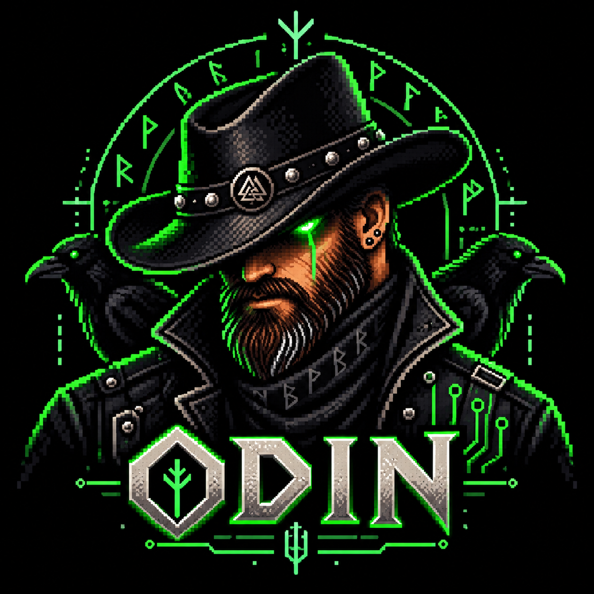

<div align="center">



# ODIN

**Deterministic repository forensics.**

Analyze one repository read-only. Produce a reproducible evidence packet named exactly `findings.zip`.

A portable agent skill — the same directory works with Claude Code, Codex, and any agent that can read Markdown and run Python.

</div>

---

## What lands in a findings packet

- **Executive summary**, repository overview and architecture synthesis
- **One documentation record per physical file** — binaries, generated code, vendored trees and `.git` internals included
- **One documentation record per module**, with a stable module ID
- Exhaustive **filesystem inventory** with SHA-256 for every file, language/file-type/role classification keyed to explicit evidence rules, and Git state as supplementary metadata
- **Symbols, types, imports and relationship graphs**, with the parser that produced them recorded per language
- **Dependency graph, CycloneDX and SPDX SBOMs**, licenses and advisories
- **Security findings** in SARIF, plus redacted secret candidates that are never printed and never validated
- **Test inventory, results and measured coverage** — or an explicit statement that none was measured
- **TODOs and unfinished work**, separated from historical comments and deliberate fixtures
- **Mermaid diagrams**: architecture, modules, runtime, data flow, build/test, dependencies, sequences
- **Reproducibility instructions**, an action manifest of everything attempted *and skipped*, tool versions, and integrity hashes

## The guarantees

| Guarantee | How it is enforced |
| --- | --- |
| The repository is never modified | SHA-256 baseline before analysis, full re-verification after; `init` refuses an artifact root inside the repository |
| Nothing is invented | every conclusion carries an evidence label — `OBSERVED`, `DECLARED`, `DERIVED`, `DOCUMENTED`, `INFERRED` |
| No secret is exposed | category, location, redaction and a non-reversible fingerprint — never the value, never a validation attempt |
| No untrusted code runs unsandboxed | dynamic analysis is gated on real isolation; without it, static analysis only, documented as skipped |
| The run is reproducible | fixed environment, bytewise path ordering, no wall-clock time in packet content, byte-identical packaging |
| Failures don't abort the run | fail-soft with documented fallbacks; a partial packet beats no packet |

## ODIN analyzed itself

Every number below is from ODIN's own self-analysis packet, not an estimate.

| | |
| --- | --- |
| Files inventoried | **27** regular files, 6 directories, 7,421 lines |
| Modules documented | **7** |
| Symbols indexed | **149**, via the native CPython `ast` — 0 parse errors |
| Third-party dependencies | **0** — all 81 imports verified against `sys.stdlib_module_names` |
| Repository integrity after the run | **PASS** — all 27 files re-hashed identically |
| Packaging | **byte-identical** across consecutive runs (demonstrated, not assumed) |
| Validation | **PASS** — 96 manifest entries, 0 mismatches |

It also reported honestly on itself: **no test suite**, **no LICENSE**, one unimplemented protocol requirement (archive member inspection), and a Medium-severity finding that generated packets record the operator's `PATH` and `HOME`. A tool that cannot find its own gaps is not an audit tool.

## Install

```powershell
# Windows
.\install\install.ps1                  # every CLI detected
.\install\install.ps1 -Target claude   # Claude Code only
```

```bash
# macOS / Linux
./install/install.sh                   # every CLI detected
./install/install.sh --target codex    # Codex only
```

Installs to `~/.claude/skills/odin` and `~/.codex/skills/odin`, plus a `~/.codex/prompts/odin.md` slash prompt with the skill path substituted in. `--scope project` installs into `<project>/.claude/skills` instead. Nothing is overwritten without `--force` / `-Force`.

## Use

**Claude Code** — `/odin`, or just ask: *"audit this repository with ODIN"*.

**Codex** — `/odin [REPO_ROOT] [--artifacts DIR] [--network denied] [--sandbox none]`.

**Any other agent** — point it at this directory and tell it to read `SKILL.md`.

**By hand** — the toolkit works on its own:

```bash
export ODIN_ARTIFACT_ROOT=/tmp/odin-run
python scripts/odin.py init --repo /path/to/repo --artifacts "$ODIN_ARTIFACT_ROOT"
python scripts/odin.py env
python scripts/odin.py inventory
python scripts/odin.py todos
python scripts/odin.py secrets
python scripts/odin.py docstub
#   ... the agent writes the analysis and completes every record ...
python scripts/odin.py verify
python scripts/odin.py validate
python scripts/odin.py manifest
python scripts/odin.py package
```

## Requirements

**Python 3.8+, standard library only.** No pip install, no network, no third-party packages — verified, not just claimed.

Git is used read-only when present and is optional. Everything else — compilers, linters, SAST tools, SBOM generators, Mermaid renderers, sandboxes — is optional. ODIN records what was unavailable and what that leaves unknown rather than pretending it ran.

## Layout

```
SKILL.md        entry point: five hard rules, inputs, phases 0-12, reference map
PROTOCOL.md     the normative protocol — binding; wins over everything else
reference/      phases · toolkit · evidence · sandbox · dependencies · security
                architecture · packet
templates/      file-record · module-record · top-level-documents
scripts/        odin.py + odin_lib/ — the stdlib-only toolkit
prompts/        Codex / generic slash-prompt shim
install/        installers
AGENTS.md       entry point for agents working in or on this directory
```

Two layers, deliberately separated. The **protocol layer** is prose: `PROTOCOL.md` is normative, `SKILL.md` stays short enough to read on every run, and `reference/` loads on demand. The **toolkit layer** is code, implementing exactly the mechanical work an agent otherwise gets wrong — traversal order, hashing baselines, symlink and hard-link rules, evidence-keyed classification, redacted scanning, sequence-numbered action logging, validation, byte-reproducible packaging.

Everything requiring judgment stays with the agent, under the protocol's rules.

## Known gaps

Reported by ODIN against itself, and not yet fixed:

- **No automated test suite.** The determinism, non-modification and redaction guarantees are implemented visibly and were verified manually against a fixture repository, but nothing protects them against regression.
- **No LICENSE file.** Default copyright applies; terms of reuse are undefined.
- **The protocol's ARCHIVE RULE is unimplemented in the toolkit.** Archives are classified by magic number but their member tables are not enumerated.
- **Generated packets record the operator's `PATH`, `HOME` and `USERPROFILE`.** Review `inventory/environment.json` before sharing a `findings.zip`.

## Scope

ODIN does one repository per run and does not narrow the deliverable on its own. Ask for something smaller — *"just the inventory"*, *"just the secrets"* — and it runs only those phases, says plainly that the result is not a full packet, and does not emit a `findings.zip` implying coverage it did not perform.
