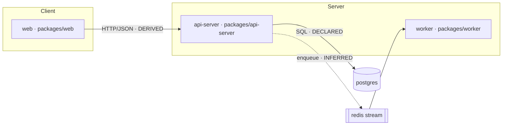

# Architecture synthesis and diagrams

## Module boundaries

Determine them in this priority order:

1. Explicit workspace/build/package boundaries (npm workspaces, Cargo workspace
   members, Go modules, Maven/Gradle subprojects, `.sln` projects, Bazel packages,
   pnpm workspaces, Nx/Turbo projects)
2. Language package/module boundaries
3. Deployable service or application boundaries
4. Independently tested or built components
5. Coherent directory boundaries: the fallback, and label it `INFERRED`

## Stable module IDs

Derive the ID from the normalized repository-relative path or package identity, so the
same repository yields the same IDs on every run. Replace path separators with `-`,
lowercase, and keep it filesystem-safe: it becomes `modules/<id>.md`.

`src/core` → `src-core`  ·  `packages/api-server` → `packages-api-server`  ·  the
repository root as a single module → `root`

Write the registry to `inventory/modules.json`. `odin.py validate` reads it to check
that every module has a document:

```json
{
  "modules": [
    {
      "id": "packages-api-server",
      "name": "@acme/api-server",
      "path": "packages/api-server",
      "boundary_evidence": "DECLARED: pnpm-workspace.yaml:3, packages/api-server/package.json",
      "kind": "service"
    }
  ]
}
```

## Required diagrams

Mermaid `.mmd` source is canonical. Keep the source whether or not it renders.

| File | Shows |
| --- | --- |
| `graphs/architecture.mmd` | system/context: the repository in its environment |
| `graphs/modules.mmd` | module/component architecture and internal dependencies |
| `graphs/runtime.mmd` | runtime processes, services, listeners, datastores |
| `graphs/data-flow.mmd` | principal data flows across trust boundaries |
| `graphs/build-test.mmd` | build and test pipeline |
| `graphs/dependencies.mmd` | external dependency graph |
| `graphs/sequence-*.mmd` | one per important runtime flow |

If a local trusted Mermaid renderer is available with no network access, render to
`graphs/rendered/` as SVG and optionally PNG. A rendering failure is a recorded
non-blocking error, not a reason to drop the diagram.

## Sequence diagrams for libraries

A pure library with no server or application runtime does not get an invented service
architecture. Its sequence diagrams cover representative public API flows,
initialization, the build, or the test flow instead.

## Diagram conventions

Keep them readable and evidence-bound:

- Name nodes after real modules, services and files: not abstractions you invented.
- Mark uncertainty in the diagram itself: dashed edges for `INFERRED` relationships,
  a distinct style for unresolved or dynamic edges.
- Keep one diagram to one question. Six focused diagrams beat one unreadable one.
- Keep an evidence reference behind every inferred edge, in `ARCHITECTURE.md` or the
  module document: a reader must be able to ask "why is that arrow there?" and get an
  answer.



## Documented versus inferred architecture

Analyze the repository's own diagrams and architecture documents too, then compare them
with what you inferred. Report the meaningful inconsistencies: a component the docs
describe that no longer exists, a service the code talks to that no diagram shows, a
dependency direction that has reversed. That comparison is often the most valuable
paragraph in `ARCHITECTURE.md`.

## What each module document must answer

Purpose and responsibility; directory/package boundaries; public API; main types and
symbols; internal dependencies; external dependencies; initialization and lifecycle;
entry points; configuration and environment; persistent and transient state; data
inputs and outputs; service/API/database/message interactions; concurrency model;
error handling; security and trust boundaries; tests; measured coverage where
available; TODO and unfinished work; known limitations; architecture relationships;
evidence and confidence.

Template: `templates/module-record.md`.
